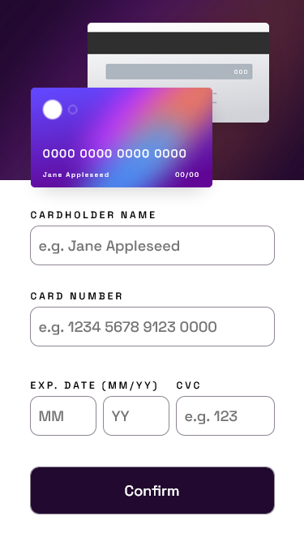

# Frontend Mentor - Interactive card details form solution

This is a solution to the [Interactive card details form challenge on Frontend Mentor](https://www.frontendmentor.io/challenges/interactive-card-details-form-XpS8cKZDWw). Frontend Mentor challenges help you improve your coding skills by building realistic projects.

## Table of contents

-   [Overview](#overview)
    -   [The challenge](#the-challenge)
    -   [Screenshot](#screenshot)
    -   [Links](#links)
-   [My process](#my-process)
    -   [Built with](#built-with)
    -   [What I learned](#what-i-learned)
    -   [Useful resources](#useful-resources)

**Note: Delete this note and update the table of contents based on what sections you keep.**

## Overview

### The challenge

Users should be able to:

-   Fill in the form and see the card details update in real-time
-   Receive error messages when the form is submitted if:
    -   Any input field is empty
    -   The card number, expiry date, or CVC fields are in the wrong format
-   View the optimal layout depending on their device's screen size
-   See hover, active, and focus states for interactive elements on the page

### Screenshot




### Links

-   Live Site URL: [Netlify](https://dazzling-parfait-cd24e9.netlify.app/)

## My process

### Built with

-   Semantic HTML5 markup
-   CSS custom properties
-   Flexbox
-   CSS Grid
-   JavaScript

### What I learned

Some of the things I learned include packing variables and functions that serve a common purpose into an object literal. This helps keep the code organized and easy to read, as well as not polluting the global scope.

```js
const formInputs = {
    // Form elements and methods contained here.
};
```

### Useful resources

-   [Box shadow generator](https://cssgenerator.org/box-shadow-css-generator.html) - This website helps you create css box shadow easily as you can preview how the shadow would look with the interactive tool.
